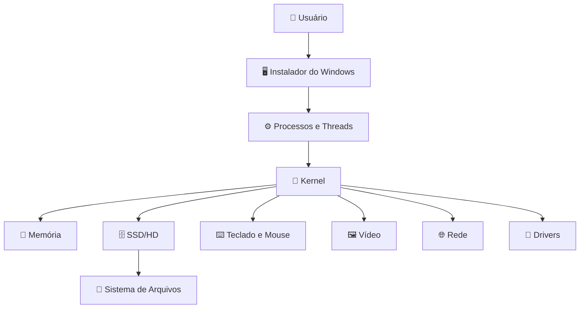

# 🖥️ Formatação e Instalação de um Sistema Operacional Windows

> **Atividade de Sistemas Operacionais**  
> **Tema:** relação entre a instalação do Windows, hardware e os principais componentes de um sistema operacional.

---

## 📚 Sumário

1. [Introdução](#-introdução)
2. [Visão geral do processo](#-visão-geral-do-processo)
3. [Preparação antes da instalação](#-preparação-antes-da-instalação)
4. [Processo completo de formatação e instalação](#-processo-completo-de-formatação-e-instalação)
5. [Componentes do Sistema Operacional](#1️⃣-componentes-do-sistema-operacional)
6. [Kernel](#2️⃣-kernel-o-núcleo-do-sistema)
7. [Modos de execução](#3️⃣-modos-de-execução)
8. [Processos](#4️⃣-processos)
9. [Programa × Processo × Thread](#5️⃣-programa--processo--thread)
10. [Sistema de arquivos](#6️⃣-sistema-de-arquivos)
11. [Entrada/Saída e Drivers](#7️⃣-entradasaída-e-drivers-de-dispositivos)
12. [Linha do tempo da instalação](#-linha-do-tempo-da-instalação)
13. [Tabela etapa × conceito](#-tabela-etapa--conceito)
14. [Desafio final](#-desafio-final)
15. [Questão central](#-questão-central-da-atividade)
16. [Conclusão](#-conclusão)

---

# 📖 Introdução

Formatar e instalar o Windows parece, à primeira vista, apenas uma sequência de telas em que o usuário escolhe um disco, aguarda a cópia de arquivos e cria uma conta. Porém, por trás dessas etapas existe uma grande quantidade de trabalho realizado pelo **sistema operacional**.

Durante a instalação, o computador precisa:

- 🧠 utilizar o processador;
- 💾 acessar memória RAM;
- 💿 ler arquivos da mídia de instalação;
- 🗄️ identificar SSDs e HDs;
- 🧩 criar ou modificar partições;
- 📂 criar sistemas de arquivos;
- 📥 copiar milhares de arquivos;
- ⚙️ detectar dispositivos;
- 🔌 carregar drivers;
- 🔐 definir permissões;
- 🚀 preparar a inicialização;
- 🌐 configurar rede;
- 👤 criar contas e preferências.

Tudo isso depende de conceitos fundamentais estudados em Sistemas Operacionais, como **kernel, processos, threads, modos de execução, sistema de arquivos, entrada/saída e drivers**.

> 🎯 **Questão central:**  
> **Ao formatar e instalar o Windows, onde o Sistema Operacional está trabalhando e por que cada um desses componentes é necessário?**

A instalação do Windows é um bom exemplo prático porque mostra o sistema operacional funcionando como uma **camada intermediária entre software e hardware**.

---

# 🧭 Visão geral do processo

De forma simplificada, o processo acontece assim:

```text
Ligar o computador
        ↓
BIOS/UEFI realiza verificações iniciais
        ↓
Pendrive de instalação é selecionado
        ↓
Windows PE / Instalador é carregado
        ↓
Hardware básico é identificado
        ↓
Usuário escolhe a unidade
        ↓
Partições são criadas/modificadas
        ↓
Sistema de arquivos é formatado
        ↓
Arquivos do Windows são copiados
        ↓
Arquivos de inicialização são configurados
        ↓
Computador reinicia
        ↓
Windows inicia pelo SSD/HD
        ↓
Drivers e serviços são configurados
        ↓
OOBE / configuração inicial
        ↓
Windows pronto para uso
```

### 🔗 Relação geral entre os conceitos



O usuário interage com o instalador, mas o instalador não controla diretamente o hardware. As operações passam pelo sistema operacional, principalmente por meio do **kernel e dos drivers**.

---

# 🧰 Preparação antes da instalação

Antes de iniciar a formatação, é necessário preparar o computador.

## 📦 Materiais necessários

- 💻 computador compatível com o Windows;
- 💾 pendrive de instalação;
- 📀 imagem de instalação do Windows;
- 🌐 conexão com a internet, quando necessária;
- 🔑 licença/chave de produto, quando aplicável;
- 💽 backup dos arquivos importantes.

> ⚠️ **Atenção:** alterar ou excluir partições pode provocar perda de dados. Antes da formatação, os arquivos importantes devem ser salvos em outro dispositivo ou serviço de armazenamento.

---

## 🔧 BIOS/UEFI

Quando o computador é ligado, antes mesmo do Windows iniciar, o firmware **BIOS ou UEFI** entra em funcionamento.

Ele realiza tarefas iniciais, como:

- verificar componentes básicos;
- identificar memória RAM;
- detectar dispositivos de armazenamento;
- localizar dispositivos inicializáveis;
- escolher de onde o computador deve iniciar.

Em computadores modernos, normalmente utiliza-se **UEFI**.

### Exemplo de ordem de inicialização

```text
1. Pendrive USB
2. SSD NVMe
3. SSD SATA
4. Rede
```

Para instalar o Windows pelo pendrive, o computador precisa iniciar pela mídia USB.

> 💡 Nesse momento o Windows ainda não está funcionando no SSD/HD. O firmware é responsável por localizar e iniciar o carregador presente no pendrive.

---

# 🛠️ Processo completo de formatação e instalação

## 1. ⚡ Ligando o computador

Ao pressionar o botão de energia, a placa-mãe inicializa seus componentes.

O firmware realiza verificações iniciais e identifica dispositivos essenciais.

### Conceitos relacionados

- hardware;
- inicialização;
- entrada/saída;
- armazenamento;
- firmware.

Ainda não existe um sistema operacional Windows carregado na memória principal.

---

## 2. 💾 Inicialização pelo pendrive

Após identificar os dispositivos, o UEFI procura um dispositivo inicializável.

Se o pendrive estiver configurado como prioridade, ele será utilizado.

O firmware localiza os arquivos necessários para carregar o ambiente de instalação.

### Fluxo

```text
UEFI
  ↓
Pendrive inicializável
  ↓
Windows Boot Manager
  ↓
Ambiente de instalação
```

---

## 3. 🪟 Carregamento do ambiente de instalação

O instalador do Windows utiliza um ambiente reduzido chamado **Windows PE (Windows Preinstallation Environment)**.

Ele contém componentes suficientes para:

- exibir a interface do instalador;
- reconhecer hardware básico;
- acessar armazenamento;
- ler o pendrive;
- trabalhar com partições;
- copiar os arquivos do Windows.

Nesse momento já existe um ambiente operacional executando na memória RAM.

> 🧠 É a partir desse ponto que conceitos como **kernel, processos, memória e drivers** passam a aparecer claramente.

---

## 4. ⌨️ Escolha de idioma e preferências

O usuário escolhe opções como:

- idioma;
- formato de hora;
- teclado;
- método de entrada.

Para que essa tela funcione, o sistema precisa utilizar:

- driver de vídeo;
- driver de teclado;
- driver de mouse;
- processos da interface;
- memória;
- CPU.

O usuário está interagindo com programas em **modo usuário**, enquanto o acesso ao hardware ocorre por intermédio do kernel e dos drivers.

---

## 5. 💿 Seleção da edição e início da instalação

O instalador identifica a edição do Windows disponível e solicita informações necessárias.

Podem aparecer etapas como:

- chave do produto;
- edição do Windows;
- aceite dos termos;
- tipo de instalação.

Para uma instalação limpa, normalmente é escolhida a opção de instalação personalizada.

---

## 6. 🗄️ Seleção da unidade

O instalador mostra os discos e partições disponíveis.

Exemplo:

| Unidade | Tipo | Tamanho | Situação |
|---|---|---:|---|
| Disco 0 Partição 1 | Sistema EFI | 100 MB | Sistema |
| Disco 0 Partição 2 | Reservada | 16 MB | MSR |
| Disco 0 Partição 3 | Primária | 476 GB | Windows |
| Disco 1 | Pendrive | 16 GB | Instalação |

O usuário deve identificar corretamente o disco em que o Windows será instalado.

> ⚠️ Excluir a partição errada pode apagar dados de outra unidade.

---

## 7. 🧩 Particionamento

**Particionar** significa dividir logicamente um dispositivo de armazenamento em uma ou mais regiões.

Um único SSD pode conter várias partições.

Exemplo:

```text
SSD de 500 GB
│
├── EFI
├── MSR
├── Windows
└── Recuperação
```

Em uma instalação moderna com UEFI e GPT, o Windows pode criar automaticamente as partições necessárias.

### Possíveis partições

| Partição | Função |
|---|---|
| 🟦 EFI System Partition | Guarda arquivos utilizados na inicialização |
| ⚙️ Microsoft Reserved | Reservada para gerenciamento do disco |
| 🪟 Partição principal | Onde o Windows é instalado |
| 🛠️ Recuperação | Ferramentas de recuperação |

> 💡 Particionar **não é a mesma coisa que formatar**.

---

## 8. 🧹 Formatação

Após definir a partição principal, ela precisa possuir um sistema de arquivos adequado.

No Windows, normalmente utiliza-se **NTFS** na partição principal.

A formatação cria estruturas necessárias para organizar arquivos e diretórios.

Ela prepara o espaço para que o sistema operacional possa armazenar:

- arquivos;
- pastas;
- permissões;
- metadados;
- registros relacionados ao sistema de arquivos.

---

## 9. 📥 Cópia dos arquivos do Windows

Depois da preparação do disco, o instalador começa a transferir os arquivos necessários.

O fluxo simplificado é:

```text
Pendrive
   ↓ leitura
Memória RAM
   ↓ processamento
SSD/HD
   ↓ escrita
Arquivos do Windows
```

Nesse momento existem várias operações de **entrada e saída**.

A CPU não copia fisicamente cada bit de forma direta. O sistema operacional coordena controladores, memória, buffers, drivers e dispositivos.

---

## 10. 📦 Aplicação da imagem do sistema

A mídia de instalação contém uma imagem do Windows.

Essa imagem é aplicada na partição de destino.

Entre os arquivos criados estão diretórios como:

```text
C:\
├── Windows
├── Program Files
├── Program Files (x86)
└── Users
```

Durante essa fase também são preparados diversos componentes do sistema.

---

## 11. 🚀 Configuração da inicialização

O computador precisa saber como carregar o Windows depois que o pendrive for removido.

Por isso, o instalador cria/configura os arquivos necessários para inicialização.

Em sistemas UEFI, a partição EFI contém arquivos utilizados pelo **Windows Boot Manager**.

Fluxo simplificado após a instalação:

```text
UEFI
  ↓
Windows Boot Manager
  ↓
Carregador do Windows
  ↓
Kernel
  ↓
Drivers essenciais
  ↓
Serviços
  ↓
Tela de login / ambiente do usuário
```

---

## 12. 🔄 Reinicialização

Após copiar os arquivos e preparar o sistema, o computador reinicia.

A partir desse momento, o objetivo é iniciar pelo Windows instalado no SSD/HD e não mais pelo pendrive.

O carregador encontra os componentes do sistema e inicia o Windows.

---

## 13. 🧠 Inicialização do kernel

O kernel do Windows é carregado para a memória.

Ele passa a controlar recursos fundamentais, como:

- CPU;
- memória;
- processos;
- interrupções;
- dispositivos;
- acesso ao armazenamento;
- comunicação com drivers.

O arquivo central do kernel do Windows é associado ao **ntoskrnl.exe**, que faz parte do núcleo do sistema.

> 🧩 A partir daqui, o Windows instalado deixa de ser apenas um conjunto de arquivos no disco e passa efetivamente a funcionar como um sistema operacional em execução.

---

## 14. 🔌 Detecção e configuração de drivers

O Windows identifica dispositivos disponíveis no computador.

Exemplos:

- placa de vídeo;
- placa de rede;
- áudio;
- chipset;
- controladores USB;
- SSD/NVMe;
- dispositivos Bluetooth;
- touchpad.

Quando existe um driver compatível disponível, o Windows pode instalá-lo automaticamente.

Outros drivers podem ser obtidos por:

- Windows Update;
- fabricante da placa-mãe;
- fabricante do notebook;
- fabricante da GPU;
- fabricante do dispositivo.

---

## 15. 👤 Configuração inicial — OOBE

Depois da instalação principal, o Windows apresenta a experiência inicial conhecida como **OOBE — Out-of-Box Experience**.

Nela podem ser definidos:

- região;
- teclado;
- rede;
- nome do dispositivo;
- conta;
- senha/PIN;
- opções de privacidade;
- preferências.

A partir desse momento, muitos serviços do sistema já estão funcionando.

---

## 16. 🌐 Atualizações

Com acesso à internet, o Windows pode procurar:

- atualizações de segurança;
- correções;
- drivers;
- componentes adicionais;
- atualizações do próprio sistema.

Isso é importante porque a mídia de instalação pode não conter as versões mais recentes dos componentes.

---

## 17. ✅ Windows pronto para utilização

Ao final, o sistema apresenta a área de trabalho.

Nesse ponto, o sistema operacional está gerenciando simultaneamente:

```text
CPU
RAM
SSD/HD
GPU
Rede
Áudio
USB
Teclado
Mouse
Processos
Arquivos
Permissões
Serviços
Aplicações
```

---

# 1️⃣ Componentes do Sistema Operacional

Um sistema operacional não é um único programa. Ele é formado por vários componentes que trabalham juntos.

## 📊 Principais componentes envolvidos

| Componente | Função | Onde aparece na instalação |
|---|---|---|
| 🧠 Kernel | Controla recursos do hardware | Inicialização do Windows PE e do Windows instalado |
| ⚙️ Gerenciador de processos | Controla processos e CPU | Instalador, serviços e configuração |
| 💾 Gerenciador de memória | Controla RAM | Durante todo o ambiente de instalação |
| 📂 Sistema de arquivos | Organiza dados | Formatação, cópia e organização dos arquivos |
| 🔌 Drivers | Fazem comunicação com dispositivos | Teclado, vídeo, disco, rede etc. |
| 💽 Subsistema de E/S | Gerencia leitura e escrita | Pendrive, SSD, teclado, mouse, rede |
| 🔐 Segurança | Controla acessos e permissões | Arquivos, usuários, serviços |
| 🚀 Gerenciador de inicialização | Permite iniciar o Windows | Partição EFI e boot |
| 🌐 Rede | Permite comunicação | Atualizações e configuração online |

---

## 🧠 Gerenciamento de recursos

Durante a instalação, os principais recursos gerenciados são:

### CPU

Usada para:

- executar o instalador;
- descompactar arquivos;
- configurar componentes;
- executar processos.

### Memória RAM

Usada para:

- carregar o ambiente de instalação;
- armazenar programas em execução;
- criar buffers de leitura/escrita;
- manter dados temporários.

### Armazenamento

Usado para:

- ler o pendrive;
- criar partições;
- formatar;
- copiar arquivos;
- preparar o sistema.

### Dispositivos

Exemplos:

- teclado;
- mouse;
- monitor;
- SSD;
- pendrive;
- rede.

---

# 2️⃣ Kernel: O Núcleo do Sistema

O **kernel** é a parte central do sistema operacional.

Ele atua como uma ponte entre aplicações e hardware.

```text
Aplicações
    ↓
Chamadas ao Sistema
    ↓
🧠 Kernel
    ↓
Drivers
    ↓
Hardware
```

---

## ⏱️ Quando o kernel passa a atuar?

Durante a instalação, o kernel começa a atuar quando o ambiente do Windows usado pelo instalador é carregado.

O instalador não precisa esperar o Windows estar completamente instalado no SSD para utilizar um kernel.

O próprio ambiente de instalação precisa:

- gerenciar memória;
- executar processos;
- acessar discos;
- controlar dispositivos;
- usar drivers.

Depois da primeira reinicialização, o kernel do Windows instalado passa a ser carregado diretamente do disco.

---

## ⚙️ O que o kernel gerencia?

| Recurso | Exemplo durante a instalação |
|---|---|
| 🧠 CPU | Distribuição de tempo entre processos |
| 💾 RAM | Memória usada pelo instalador |
| 🗄️ Disco | Leitura e escrita no SSD |
| 🔌 Dispositivos | Comunicação por drivers |
| 🧵 Threads | Execução concorrente |
| 🔐 Proteção | Separação entre processos |
| ⚡ Interrupções | Eventos de hardware |

---

## 🔗 Comunicação entre software e hardware

Um programa comum não deve manipular diretamente um SSD, uma placa de vídeo ou a memória física.

O fluxo é semelhante a:

```text
Instalador
   ↓
Solicitação de leitura/escrita
   ↓
Kernel
   ↓
Driver de armazenamento
   ↓
Controlador
   ↓
SSD
```

Isso torna o sistema mais seguro e organizado.

---

# 3️⃣ Modos de Execução

Os processadores modernos utilizam níveis de privilégio.

No estudo de Sistemas Operacionais, dois modos são especialmente importantes:

- 👤 **Modo Usuário**
- 🧠 **Modo Kernel**

---

## 👤 Modo Usuário

É o modo em que executam programas comuns.

Exemplos:

- interface do instalador;
- ferramentas de configuração;
- aplicativos;
- partes da experiência OOBE.

Esses programas possuem acesso limitado ao hardware.

---

## 🧠 Modo Kernel

É o modo privilegiado.

Nele executam componentes que precisam controlar diretamente recursos críticos.

Exemplos:

- kernel;
- partes dos drivers;
- gerenciamento de memória;
- rotinas de baixo nível.

---

## 📊 Comparação

| Característica | Modo Usuário | Modo Kernel |
|---|---|---|
| Nível de privilégio | Baixo | Alto |
| Acesso ao hardware | Indireto | Privilegiado |
| Falha de um programa | Normalmente afeta o próprio processo | Pode comprometer o sistema inteiro |
| Exemplos | Instalador/interface | Kernel e drivers |
| Proteção | Maior isolamento | Alto nível de responsabilidade |

---

## ❓ Por que não permitir acesso irrestrito ao hardware?

Se qualquer programa pudesse acessar diretamente qualquer área da memória ou dispositivo:

- poderia sobrescrever dados;
- poderia travar o computador;
- poderia acessar informações de outros programas;
- poderia modificar estruturas do sistema;
- poderia danificar logicamente dados armazenados;
- poderia comprometer a segurança.

Por isso, programas em modo usuário solicitam serviços ao sistema operacional.

```text
Programa
   ↓
Solicitação
   ↓
Sistema Operacional
   ↓
Validação
   ↓
Hardware
```

> 🔐 Essa separação é uma das principais formas de proteção dos sistemas modernos.

---

# 4️⃣ Processos

Um **processo** é um programa em execução.

Um arquivo armazenado no pendrive ou no disco é apenas um programa enquanto não está executando.

Quando é carregado na memória e passa a utilizar CPU e outros recursos, ele se torna um processo.

---

## ⚙️ Durante a instalação

Diversas atividades precisam ocorrer.

Exemplos:

- interface do instalador;
- leitura de arquivos;
- aplicação da imagem;
- configuração do sistema;
- detecção de hardware;
- instalação de drivers;
- inicialização de serviços.

Cada atividade pode envolver um ou mais processos.

---

## 🧠 O que o sistema operacional precisa controlar?

Para cada processo, o sistema precisa administrar informações como:

- identificação;
- estado;
- memória;
- recursos abertos;
- arquivos;
- threads;
- prioridade;
- tempo de CPU.

---

## 🔄 Estados de um processo

```text
        ┌───────────┐
        │   Pronto  │
        └─────┬─────┘
              ↓
        ┌───────────┐
        │ Executando│
        └─────┬─────┘
         ↙          ↘
 Esperando         Finalizado
    ↓
  Pronto
```

Um processo que precisa esperar o SSD concluir uma leitura pode sair temporariamente da CPU.

Enquanto isso, outro processo pode executar.

Isso melhora o aproveitamento do processador.

---

# 5️⃣ Programa × Processo × Thread

Esses três conceitos são relacionados, mas não significam a mesma coisa.

## 📊 Comparação

| Conceito | Definição |
|---|---|
| 📦 **Programa** | Conjunto de instruções armazenado em um arquivo |
| ⚙️ **Processo** | Instância de um programa em execução |
| 🧵 **Thread** | Fluxo de execução dentro de um processo |

---

## 🪟 Exemplo durante a instalação

Podemos usar como exemplo o próprio **programa de instalação do Windows**.

### 📦 Programa

O instalador existe como arquivos armazenados na mídia de instalação.

Enquanto está apenas armazenado, ele é um programa.

```text
Pendrive
└── Arquivos do instalador
```

---

### ⚙️ Processo

Quando o programa é carregado na memória e começa a executar, ele passa a existir como processo.

O processo recebe:

- espaço de memória;
- tempo de CPU;
- acesso controlado a arquivos;
- recursos do sistema.

---

### 🧵 Threads

Dentro de um mesmo processo podem existir diferentes threads.

Por exemplo, conceitualmente:

```text
Processo de instalação
│
├── 🧵 Thread 1 → interface
├── 🧵 Thread 2 → leitura de arquivos
├── 🧵 Thread 3 → processamento
└── 🧵 Thread 4 → atualização do progresso
```

O uso de múltiplas threads pode melhorar a eficiência porque algumas atividades podem ocorrer de forma concorrente.

Enquanto uma thread espera uma operação de disco, outra pode atualizar a interface ou preparar outros dados.

---

## 💡 Por que threads são úteis?

- 🚀 melhor aproveitamento da CPU;
- 🎨 interface mais responsiva;
- 📥 execução concorrente de tarefas;
- ⏳ redução de períodos ociosos;
- 🧠 compartilhamento do mesmo espaço de memória do processo.

> ⚠️ Threads de um mesmo processo compartilham muitos recursos. Por isso, também precisam de sincronização para evitar conflitos.

---

# 6️⃣ Sistema de Arquivos

O sistema de arquivos define como os dados são organizados e armazenados.

Durante a instalação do Windows, esse conceito é fundamental.

---

## 🧩 Apagar × Particionar × Formatar

Esses três conceitos não são iguais.

| Operação | O que significa? | Exemplo |
|---|---|---|
| 🗑️ **Apagar dados** | Remover arquivos ou referências a eles | Excluir uma pasta |
| 🧩 **Particionar** | Dividir o disco em regiões lógicas | Criar C: e outra partição |
| 🧹 **Formatar** | Criar uma estrutura de sistema de arquivos | Preparar uma partição em NTFS |

---

## 🗑️ Apagar dados

Excluir um arquivo normalmente remove sua referência do sistema de arquivos e libera aquele espaço para reutilização.

Isso não é a mesma coisa que criar uma nova partição ou formatar a unidade inteira.

---

## 🧩 Particionar

Particionar define as divisões lógicas do disco.

Exemplo:

```text
SSD
├── Partição EFI
├── Partição MSR
├── Partição Windows
└── Partição Recovery
```

---

## 🧹 Formatar

Formatar cria as estruturas do sistema de arquivos.

Na partição do Windows, normalmente utiliza-se **NTFS**.

O NTFS permite recursos como:

- diretórios;
- permissões;
- metadados;
- arquivos grandes;
- controle de acesso;
- journaling.

---

## 📥 Cópia dos arquivos

Após a formatação, os arquivos são colocados na partição.

Entre os diretórios principais estão:

```text
C:\
├── Windows
├── Program Files
├── Program Files (x86)
├── Users
└── ProgramData
```

---

## 🚀 Arquivos de inicialização

O sistema também precisa preparar arquivos utilizados na inicialização.

Em UEFI, a **EFI System Partition** possui arquivos necessários para o firmware localizar o gerenciador de inicialização do Windows.

Sem essa preparação, os arquivos do Windows poderiam existir no SSD, mas o computador não saberia como iniciar o sistema corretamente.

---

# 7️⃣ Entrada/Saída e Drivers de Dispositivos

Entrada/Saída, ou **I/O — Input/Output**, corresponde à comunicação entre o computador e seus dispositivos.

Durante a instalação existe uma enorme quantidade de operações de E/S.

---

## ⌨️ Dispositivos envolvidos

| Dispositivo | Tipo | Papel durante a instalação |
|---|---|---|
| ⌨️ Teclado | Entrada | Digitação e seleção de opções |
| 🖱️ Mouse | Entrada | Interação com a interface |
| 🖥️ Monitor | Saída | Exibição das telas |
| 💾 Pendrive | Entrada/armazenamento | Origem dos arquivos de instalação |
| 🗄️ SSD/HD | Entrada/Saída | Recebe o Windows |
| 🌐 Placa de rede | Entrada/Saída | Internet e atualizações |
| 🔊 Áudio | Saída | Uso após configuração |
| 🔵 Bluetooth | Entrada/Saída | Comunicação com periféricos |
| 🎮 GPU | Saída/processamento | Geração da imagem |

---

## 🔌 O que é um driver?

Um **driver** é um software que permite que o sistema operacional se comunique com um determinado dispositivo.

Fluxo:

```text
Aplicação
   ↓
Sistema Operacional
   ↓
Driver
   ↓
Dispositivo
```

O driver conhece os detalhes específicos de como operar aquele hardware.

---

## 💽 Driver de armazenamento

Durante a instalação, o driver de armazenamento é especialmente importante.

Se o instalador não consegue conversar com o controlador do SSD, a unidade pode não aparecer.

Isso pode exigir um driver específico do fabricante ou do controlador.

---

## 🖼️ Driver de vídeo

Durante o instalador, o Windows pode utilizar um driver básico de vídeo.

Depois da instalação, um driver específico da GPU pode oferecer:

- resolução correta;
- aceleração gráfica;
- múltiplos monitores;
- melhor desempenho;
- recursos adicionais.

---

## 🌐 Driver de rede

O driver de rede permite utilizar:

- Ethernet;
- Wi-Fi;
- recursos online;
- Windows Update;
- downloads de outros drivers.

Sem um driver compatível, o sistema pode ficar sem conexão até que ele seja instalado manualmente.

---

# 🕒 Linha do tempo da instalação

```text
⚡ 1. Ligar o PC
        ↓
🧠 2. UEFI inicia
        ↓
💾 3. Pendrive é carregado
        ↓
🪟 4. Windows PE / Instalador
        ↓
🔎 5. Hardware é reconhecido
        ↓
🗄️ 6. Disco é selecionado
        ↓
🧩 7. Partições são criadas
        ↓
🧹 8. Sistema de arquivos é formatado
        ↓
📥 9. Arquivos são copiados
        ↓
🚀 10. Boot é configurado
        ↓
🔄 11. Reinicialização
        ↓
🧠 12. Kernel do Windows inicia
        ↓
🔌 13. Drivers são configurados
        ↓
👤 14. OOBE
        ↓
🌐 15. Atualizações
        ↓
✅ 16. Sistema pronto
```

---

# 📊 Tabela etapa × conceito

| Etapa | O que acontece? | Conceito envolvido | Por que é importante? |
|---|---|---|---|
| **1. Inicialização** | Firmware verifica o hardware e procura um dispositivo de boot | Entrada/Saída, hardware, firmware | Permite localizar o dispositivo que contém o instalador |
| **2. Inicialização do instalador** | Windows PE e o instalador são carregados | Kernel, processos, memória | Cria um ambiente capaz de executar a instalação |
| **3. Reconhecimento do hardware** | Discos, USB, vídeo, teclado e outros dispositivos são detectados | Drivers e Entrada/Saída | O instalador precisa conseguir utilizar os componentes |
| **4. Seleção da unidade** | Usuário escolhe onde instalar | Sistema de arquivos, armazenamento, I/O | Define o destino do sistema |
| **5. Particionamento/formatação** | Partições são criadas e a partição recebe um sistema de arquivos | Sistema de arquivos, kernel, armazenamento | Organiza o disco e prepara o local para os arquivos |
| **6. Cópia dos arquivos** | Arquivos saem do pendrive e são gravados no SSD/HD | Processos, threads, I/O, drivers | Transfere os componentes do Windows para o disco |
| **7. Instalação do Windows** | Arquivos, serviços e componentes são configurados | Kernel, processos, memória, sistema de arquivos | Constrói o sistema operacional funcional |
| **8. Instalação/configuração de drivers** | Windows associa drivers ao hardware encontrado | Drivers, modo kernel, I/O | Permite utilizar corretamente cada dispositivo |
| **9. Inicialização do sistema** | Windows Boot Manager e kernel iniciam o sistema instalado | Kernel, processos, memória, drivers | Faz o Windows assumir o controle do computador |
| **10. Windows pronto para utilização** | Interface, serviços e aplicativos podem ser utilizados | Todos os conceitos | O sistema operacional passa a gerenciar permanentemente os recursos |

---

# 🔗 Relação entre os conceitos

Os conceitos estudados não funcionam isoladamente.

Durante a cópia de um arquivo, por exemplo:

```text
Processo do instalador
        ↓
Thread solicita leitura
        ↓
Chamada ao sistema
        ↓
Kernel
        ↓
Driver USB
        ↓
Pendrive
        ↓
Memória
        ↓
Kernel
        ↓
Driver de armazenamento
        ↓
SSD
        ↓
Sistema de arquivos NTFS
```

Nesse único exemplo aparecem:

- processo;
- thread;
- modo usuário;
- modo kernel;
- kernel;
- driver;
- entrada/saída;
- sistema de arquivos.

> 🎯 Isso mostra por que a atividade exige relacionar os conceitos e não apenas defini-los separadamente.

---

# 🧩 Desafio Final

## ❓ 1. Se não existisse um Sistema Operacional, quais partes desse processo precisariam ser realizadas diretamente pelo usuário ou pelos programas?

Sem um sistema operacional, praticamente todas as tarefas de controle precisariam ser feitas diretamente pelos programas ou pelo próprio usuário.

Seria necessário controlar manualmente ou implementar individualmente:

- acesso ao processador;
- utilização da memória;
- leitura do teclado;
- movimentação do mouse;
- exibição no monitor;
- comunicação com SSD e pendrive;
- leitura e escrita em setores do disco;
- organização dos arquivos;
- controle de dispositivos;
- gerenciamento de interrupções;
- divisão do tempo de CPU;
- proteção da memória;
- gerenciamento de permissões;
- comunicação de rede.

Cada programa teria que saber exatamente como conversar com cada modelo de hardware.

Por exemplo, um instalador precisaria conter código específico para:

```text
Teclado
Mouse
GPU
SSD SATA
SSD NVMe
USB
Placa de rede
Áudio
Controladores
```

Isso tornaria os programas extremamente complexos.

Além disso, não haveria uma camada central para impedir que um programa modificasse a memória ou os dados de outro.

> ✅ O sistema operacional existe justamente para **centralizar, padronizar e proteger o acesso aos recursos do computador**.

---

## ❓ 2. Qual conceito é mais importante para transformar hardware em um sistema capaz de executar aplicações?

O conceito considerado mais importante é o **kernel**, porque ele é o núcleo responsável por coordenar os principais recursos do computador.

Sem o kernel, não existiria um componente central para:

- distribuir a CPU;
- controlar memória;
- gerenciar processos;
- intermediar acesso ao hardware;
- utilizar drivers;
- controlar operações de entrada/saída;
- oferecer serviços fundamentais aos programas.

O kernel não trabalha sozinho. Ele depende de outros componentes, como drivers e sistema de arquivos.

Porém, ele ocupa uma posição central.

### Visualmente

```text
             Aplicações
                 ↓
          Serviços do Sistema
                 ↓
             🧠 KERNEL
          ↙       ↓       ↘
       CPU      Memória   Drivers
                           ↓
                        Hardware
```

Por isso, o kernel pode ser considerado o componente que permite transformar um conjunto de peças de hardware em uma plataforma controlada capaz de executar aplicações.

---

# 🎯 Questão Central da Atividade

> **Ao formatar e instalar o Windows, onde o Sistema Operacional está trabalhando e por que cada um desses componentes é necessário?**

O sistema operacional está trabalhando desde o momento em que o ambiente de instalação do Windows é carregado.

Durante a instalação, ele atua:

- na memória RAM;
- no gerenciamento da CPU;
- no acesso ao pendrive;
- no acesso ao SSD/HD;
- na detecção de hardware;
- na criação de partições;
- na formatação;
- na cópia de arquivos;
- na configuração do boot;
- na instalação de drivers;
- na criação de processos;
- na configuração dos serviços.

Cada componente é necessário porque resolve uma parte diferente do problema.

| Componente | Necessidade |
|---|---|
| 🧠 Kernel | Controlar os recursos centrais |
| ⚙️ Processos | Organizar programas em execução |
| 🧵 Threads | Permitir múltiplos fluxos de execução |
| 👤/🧠 Modos de execução | Proteger o hardware e o sistema |
| 📂 Sistema de arquivos | Organizar os dados no disco |
| 🔌 Drivers | Comunicar o sistema com dispositivos |
| 💽 Entrada/Saída | Transferir dados entre hardware e software |

Esses componentes trabalham de forma integrada.

> 💡 **O sistema operacional não é apenas a interface que aparece na tela. Ele é a estrutura responsável por transformar o hardware em uma plataforma utilizável por programas e usuários.**

---

# 🧠 Resumo dos 7 conceitos

| # | Conceito | Definição curta | Exemplo na instalação |
|:--:|---|---|---|
| 1️⃣ | Componentes do SO | Partes responsáveis por gerenciar diferentes recursos | Kernel, memória, arquivos e drivers |
| 2️⃣ | Kernel | Núcleo do sistema operacional | Controla CPU, memória e hardware |
| 3️⃣ | Modos de execução | Separação de privilégios | Instalador em modo usuário e drivers/kernel em modo privilegiado |
| 4️⃣ | Processos | Programas em execução | Instalador e serviços |
| 5️⃣ | Programa × Processo × Thread | Arquivo, instância em execução e fluxo de execução | Instalador armazenado, executando e com múltiplas threads |
| 6️⃣ | Sistema de arquivos | Organização dos dados | NTFS na partição do Windows |
| 7️⃣ | Entrada/Saída e Drivers | Comunicação com dispositivos | Pendrive, SSD, teclado, rede e GPU |

---

# ✅ Conclusão

A formatação e instalação do Windows envolve muito mais do que simplesmente apagar arquivos e clicar em **“Avançar”**.

O processo demonstra na prática vários conceitos fundamentais dos Sistemas Operacionais.

O **kernel** controla os recursos centrais da máquina. Os **processos** representam os programas em execução, enquanto as **threads** permitem dividir atividades dentro desses processos.

A separação entre **modo usuário e modo kernel** impede que qualquer programa tenha acesso irrestrito ao hardware, aumentando a estabilidade e a segurança.

O **sistema de arquivos** organiza as informações gravadas na unidade de armazenamento, enquanto os **drivers** permitem que o Windows se comunique com dispositivos de diferentes fabricantes.

As operações de **entrada e saída** aparecem durante praticamente toda a instalação, desde a leitura do pendrive até a gravação dos arquivos no SSD.

A instalação demonstra também que os componentes do sistema operacional trabalham juntos.

```text
Usuário
   ↓
Aplicações
   ↓
Processos e Threads
   ↓
Chamadas ao Sistema
   ↓
Kernel
   ↓
Drivers
   ↓
Hardware
```

Portanto, o sistema operacional é muito mais do que a interface gráfica exibida ao usuário.

Ele é a camada responsável por organizar, controlar e proteger os recursos do computador.

Sem ele, cada programa precisaria controlar diretamente o hardware e implementar individualmente funções como acesso à memória, armazenamento, dispositivos, arquivos e rede.

> 🎓 **A instalação do Windows mostra exatamente como o sistema operacional transforma um conjunto de componentes físicos em um ambiente capaz de executar programas de forma organizada, eficiente e segura.**

---

# 📌 Checklist da entrega

- [x] Descrição do processo de formatação e instalação do Windows
- [x] Componentes do Sistema Operacional
- [x] Kernel
- [x] Modos de execução
- [x] Processos
- [x] Programa × Processo × Thread
- [x] Sistema de arquivos
- [x] Entrada/Saída e Drivers
- [x] Linha do tempo
- [x] Tabela relacionando etapas aos conceitos
- [x] Respostas do desafio final
- [x] Relação entre software, sistema operacional e hardware
- [x] Organização em Markdown

---

<div align="center">

## 🖥️ Formatação e Instalação do Windows

**Sistemas Operacionais • Hardware • Kernel • Processos • Drivers • Sistema de Arquivos**

</div>
